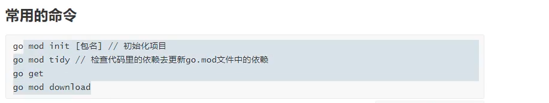
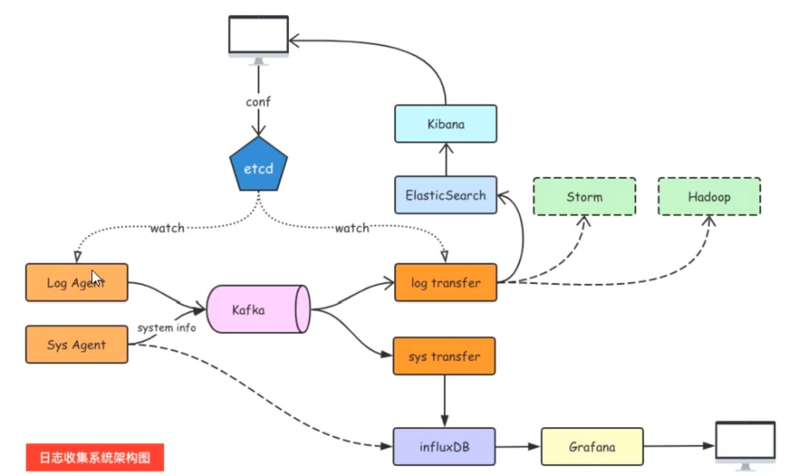

## context

### 方法

```text
//WithDeadline WithTimeout WithCancel WithValue

# context的使用
## 创建context

context包主要提供了两种方式创建context:
context.Backgroud()
context.TODO()

这两个函数其实只是互为别名，没有差别，官方给的定义是：
context.Background 是上下文的默认值，所有其他的上下文都应该从它衍生（Derived）出来。
context.TODO 应该只在不确定应该使用哪种上下文时使用；

上面的两种方式是创建根context，不具备任何功能，具体实践还是要依靠context包提供的With系列函数来进行派生：

func WithCancel(parent Context) (ctx Context, cancel CancelFunc)
func WithDeadline(parent Context, deadline time.Time) (Context, CancelFunc)
func WithTimeout(parent Context, timeout time.Duration) (Context, CancelFunc)
func WithValue(parent Context, key, val interface{}) Context


```
## go mod



## 日志收集项目



### kafka
#### 基础
#### 启动

```shell
# kafka集群安装
 curl -sSL https://raw.githubusercontent.com/bitnami/bitnami-docker-kafka/master/docker-compose.yml > docker-compose.yml
 #docker pull docker.io/bitnami/zookeeper:3.8
 #docker pull docker.io/bitnami/kafka:3.2

```
